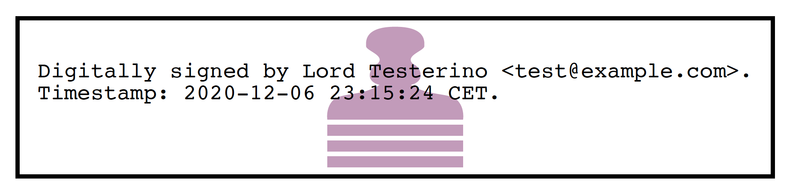

.. warning::
    This guide assumes that pyHanko is installed with all optional dependencies, including
    those required for PKCS#11 support and image support.

Signing PDF files
=================

Signing PDF files using pyHanko can be very simple or somewhat complicated,
depending on the specific requirements of your use case.
PyHanko offers support for both visible and invisible signatures, several
baseline PAdES profiles, seed values, and creating signatures using PKCS#11
devices.

.. _pdf-signing-background:

Some background on PDF signatures
---------------------------------

In order to properly understand the way pyHanko operates, having some background
on the way PDF signatures work is useful.
The goal of this subsection is to provide a bird's eye view, and covers only
the bare minimum. For further details, please refer to the relevant sections
of the ISO 32000 standard(s).

A PDF signature is always contained in a signature *field* in the PDF's
form structure.
Freeware PDF readers that do not have form editing functionality will typically
not allow you to manipulate signature fields directly, but might allow you to
fill existing form fields with a signature, or create a signature together with
its corresponding form field.
Using pyHanko, you can both insert new (empty) signature fields, and fill in
existing ones.

Separate from the signature field containing it, a signature may or may not have
an *appearance* associated with it. Signatures without such an appearance are
referred to as *invisible* signatures.
Invisible signatures have the advantage of being comparatively simpler to
implement and configure, but when a PDF containing an invisible signature
is opened in a reader application without signature support, it may not
be visually obvious that the PDF file even contains a signature at all.

The signature object itself contains some PDF-specific metadata, such as

 * the byte range of the file that it covers;
 * the hash function used to compute the document hash to be signed;
 * a modification policy that indicates the ways in which the file can still
   be modified.

The actual cryptographic signature is embedded as a CMS object.
General CMS objects are defined in :rfc:`5652`, but only a limited subset
is meaningful in PDF.
When creating a signature, the signer is authenticated using the private key
associated with an X.509 certificate, as issued by most common PKI authorities
nowadays.
The precise way this private key is provisioned is immaterial: it can be read
from a file on disk, or the signature can be generated by a hardware token;
this has no impact on the structure of the signature object in the file.

In a typical signed PDF file with only one signature, the signed byte range
covers the entire document, except for the area containing the actual
CMS data of the signature. However, there are a number of legitimate reasons
why this may *not* be the case:

 * documents containing multiple signatures and/or timestamps;
 * signatures that allow further modification, such as form filling
   or annotation.

Generally speaking, the signer decides what modifications are still
permitted after a signature is made\ [#modpolexceptions]_.

The cryptographically informed reader might ask how it is *at all* possible to
modify a file without invalidating the signature.
After all, hash functions are supposed to prevent exactly this kind of thing.
The answer here lies in the *incremental update* feature of the PDF standard.
The specification allows for updating files by appending data to the end of the
file, keeping the original bytes in place.
These incremental update sections can create and modify existing objects in the
file, while still preserving the original version in some form.
Such changes are typically opaque to the user that views the file.
The byte range attached to the signature ensures that the document hash can
still be computed over the original data, and thus the integrity of the
signature can still be validated.

However, since incremental updates allow the final rendered document to be
modified in essentially arbitrary ways, the onus is on the *validator* to ensure
that all such incremental updates made after a signature was created actually
are "legitimate" changes. What precisely constitutes a "legitimate" change
depends on the signature's modification policy, but is not rigorously defined
in the standard\ [#validationscope]_.
It goes without saying that this has led to various
`exploits <https://pdf-insecurity.org/>`_ where PDF readers could be duped into
allowing illicit modifications to signed PDF files without raising suspicion.
As a consequence of this, some signature validation tools do not even bother
to do any such validation, and simply reject *all* signatures in documents that
have been modified through incremental updates.

See :doc:`validation` for an overview of pyHanko's signature validation
features.

.. note::
    By default, pyHanko uses incremental updates for all operations,
    regardless of the presence of earlier signatures in the file.

.. _addfields-docs:

Creating signature fields
-------------------------

Adding new (empty) signature fields is done through the ``addfields`` subcommand
of ``pyhanko sign``.
The CLI only allows you to specify the page and coordinates of the field, but
more advanced properties and metadata can be manipulated through the API.

The syntax of the ``addfields`` subcommand is as follows::

    pyhanko sign addfields --field  PAGE/X1,Y1,X2,Y2/NAME input.pdf output.pdf

The page numbering starts at 1, and the numbers specify the coordinates of two
opposing corners of the bounding box of the signature field.
The coordinates are Cartesian, i.e. the y-coordinate increases from bottom to
top.
Multiple signature fields may be created in one command, by passing the last
argument multiple times.

.. note::
    You can specify page numbers "in reverse" by providing a negative number
    for the ``PAGE`` entry. With this convention, page ``-1`` refers to the last
    page of the document, page ``-2`` the second-to-last, etc.

.. note::
    Creating empty signature fields ahead of time isn't always necessary.
    PyHanko's signing functionality can also create them together with a
    signature, and Adobe Reader offers similar conveniences.
    As such, this feature is mainly useful to create fields for other
    people to sign.

Creating simple signatures
--------------------------

All operations relating to digital signatures are performed using the
``pyhanko sign`` subcommand.
The relevant command group for adding signatures is ``pyhanko sign addsig``.

.. warning::
    The commands explained in this subsection do not attempt to validate
    the signer's certificate by default.
    You'll have to take care of that yourself, either through your PDF reader
    of choice, or the :doc:`validation functionality in pyHanko <validation>`.

Signing a PDF file using key material on disk
^^^^^^^^^^^^^^^^^^^^^^^^^^^^^^^^^^^^^^^^^^^^^

There are two ways to sign a PDF file using a key and a certificate stored
on disk. The signing is performed in the exact same way in either case, but
the format in which the key material is stored differs somewhat.

To sign a file with key material sourced from loose PEM or DER-encoded files,
the ``pemder`` subcommand is used.

.. code-block:: bash

    pyhanko sign addsig --field Sig1 pemder \
        --key key.pem --cert cert.pem input.pdf output.pdf

This would create a signature in ``input.pdf`` in the signature field ``Sig1``
(which will be created if it doesn't exist), with a private key loaded from
``key.pem``, and a corresponding certificate loaded from ``cert.pem``.
The result is then saved to ``output.pdf``.
Note that the ``--field`` parameter is optional if the input file contains a
single unfilled signature field.

.. note::
    The ``--field`` parameter also accepts parameters of the form passed to
    ``addfields``, see :ref:`addfields-docs`.

You will be prompted for a passphrase to unlock the private key, which can be
read from another file using ``--passfile``.

The same result can be obtained using data from a PKCS#12 file (these usually
have a ``.pfx`` or ``.p12`` extension) as follows:

.. code-block:: bash

    pyhanko sign addsig --field Sig1 pkcs12 \
        input.pdf output.pdf secrets.pfx

By default, these calls create invisible signature fields, but if the field
specified using the ``--field`` parameter exists and has a widget associated
with it, a simple default appearance will be generated
(see :numref:`default-appearance`).

In many cases, you may want to embed extra certificates (e.g. for intermediate
certificate authorities) into your signature, to facilitate validation.
This can be accomplished using the ``--chain`` flag to either subcommand.
When using the ``pkcs12`` subcommand, pyHanko will automatically embed any extra
certificates found in the PKCS#12 archive passed in.

.. _default-appearance:

    The default appearance of a (visible) signature in pyHanko.

Signing a PDF file using a PKCS#11 token
^^^^^^^^^^^^^^^^^^^^^^^^^^^^^^^^^^^^^^^^

PyHanko also supports creating signatures using PKCS#11 devices.
In order to do so, you'll need the following information:

 - The path to the PKCS#11 module, which is typically a shared object library (``.so``, ``.dll``
   or ``.dylib``, depending on your operating system)

 - The label of the PKCS#11 token you're accessing (unless the token selection criteria
   are specified in the configuration file).

 - The PKCS#11 label(s) of the certificate and key you're using, stored in the token.
   If the key and certificate labels are the same, you can omit the key label.

Most of these settings can be stored in the configuration file as well, see
:ref:`pkcs11-setup-conf`. In fact, there are quite a few advanced settings that are not exposed
as command-line switches, but can be specified in the configuration file.
These include selecting tokens by serial number and selecting keys and certificates by ID.

With this information, producing a basic signature isn't very hard:

.. code-block:: bash

    pyhanko sign addsig pkcs11 --lib /path/to/module.so \
        --token-label testrsa --cert-label signer document.pdf output.pdf

Have a look at ``pyhanko sign addsig pkcs11 --help`` for a full list of options.

Signing a PDF file using a Belgian eID card
^^^^^^^^^^^^^^^^^^^^^^^^^^^^^^^^^^^^^^^^^^^

To sign a PDF file using your eID card, use the ``beid`` subcommand to
``addsig``, with the ``--lib`` parameter to tell pyHanko where to look for the
eID PKCS#11 library.

.. note::
    Of course, you can also use the ``pkcs11`` subcommand, but ``beid`` provides an extra layer
    of convenience.

On Linux, it is named ``libbeidpkcs11.so`` and can usually be found under
``/usr/lib`` or ``/usr/local/lib``.
On macOS, it is named ``libbeidpkcs11.dylib``, and can similarly be found under
``/usr/local/lib``.
The Windows version is typically installed to ``C:\Windows\System32`` and is
called ``beidpkcs11.dll``.

On Linux, this boils down to the following:

.. code-block:: bash

    pyhanko sign addsig --field Sig1 beid \
        --lib /path/to/libbeidpkcs11.so input.pdf output.pdf

On all platforms, the eID middleware will prompt you to enter your PIN to create
the signature.

.. warning::
    This command will produce a non-repudiable signature using the 'Signature'
    certificate on your eID card (as opposed to the 'Authentication'
    certificate). These signatures are legally equivalent to
    a normal "wet" signature wherever they are allowed, so use them with care.

    In particular, you should only allow software you trust\ [#disclaimer]_
    to use the 'Signature' certificate!

.. warning::
    You should also be aware that your national registry number
    (rijksregisternummer, no. de registre national) is embedded into the
    metadata of the signature certificate on your eID card\ [#nnserial]_.
    As such, it can also be **read off from any digital signature you create**.
    While national registry numbers aren't secret per se, they are nevertheless
    often considered sensitive personal information, so you may want to be
    careful where you send documents containing your eID signature or that
    of someone else.

.. _ltv-signing:

Creating signatures with long lifetimes
---------------------------------------

Background
^^^^^^^^^^

A simple PDF signature---or any CMS signature for that matter---is only
cryptographically valid insofar as the certificate of the signer is valid.
In most common trust models, this means that the signature ceases to be
meaningful together with the expiration of the signer certificate, or the
latter's revocation.

The principal reason for this is the fact that it is no longer practical to
verify whether a certificate was valid at the time of signing, if validation
happens after the certificate already expired or was revoked.
This, in turn, has to do with the fact that it is not always reasonable for
certificate authorities to publicly supply historical validity proofs for all
certificates they ever signed at all possible points in time.

Hence, in order for a signature to remain valid long after signing, the signer
needs to supply two additional pieces of data:

1. a trusted timestamp signed by a time stamping authority (TSA), to prove the
   time of signing to the validator;
2. revocation information (relevant CRLs or OCSP responses) for all certificates
   in the chain of trust of the signer's certificate, and of the TSA.

For both of these, it is crucial that the relevant data is collected at the time
of signing and embedded into the signed document.
The revocation information in particular can be delicate, since the validator
needs to be able to verify the validity of not only the signer's certificate,
but also that of all issuers in the chain of trust, the OCSP responder's
certificates used to sign the embedded OCSP responses, etc.

Time stamp tokens are commonly obtained from TSA's via the HTTP-based protocol
specified in :rfc:`3161`.

Within the PDF standard, there are two broad categories of such long-lived
signatures.

* Signers can opt to embed revocation information into the CMS data structure
  of the signature, as a signed attribute.

  * In this case, the revocation info is a signed attribute,
    protected from tampering by the signer's own signature.
  * This scheme uses Adobe-specific extensions to the CMS standard, which
    are explicitly defined in the PDF specification, but may not be supported
    by generic CMS tools that are unaware of PDF.

* Signers can opt to embed revocation information into the Document Security
  Store (DSS).

  * In this case the revocation info is (a priori) not protected by a
    signature, although this is often remedied by appending a document time
    stamp after updating the DSS (see also :ref:`lta-sigs`).
  * The above approach has the convenient side effect that it can be used to
    'fix' non-LTV-enabled signatures by embedding the required revocation
    information after the fact, together with a document timestamp.
    Obviously, this is predicated on the certificate's still being valid
    when the revocation information is compiled.
    This workflow is not guaranteed to be acceptable in all X.509 validation
    models, but is supported in pyHanko through the ``ltvfix`` subcommand; see
    :ref:`ltv-fix`.
  * This approach is used in the PAdES baseline profiles B-LT and B-LTA
    defined by ETSI, and the (mildly modified) versions subsumed into
    ISO 32000-2 (PDF 2.0). As such, it is not part of ISO 32000-1 'proper'.

.. note::
    The author generally prefers the DSS-based signature profiles over the
    legacy approach based on CMS attributes, but both are supported in pyHanko.

Timestamps in pyHanko
^^^^^^^^^^^^^^^^^^^^^

Embedding a timestamp token into a signature using pyHanko is as simple as
passing the ``--timestamp-url`` parameter to ``addsig``. The URL should
resolve to an endpoint that responds to the HTTP-based protocol described in
:rfc:`3161`.

.. code-block:: bash

    pyhanko sign addsig --field Sig1 --timestamp-url http://tsa.example.com \
        pemder --key key.pem --cert cert.pem input.pdf output.pdf

.. warning::
    In the CLI, only public time stamping servers are supported right now
    (i.e. those that do not require authentication). The API is more flexible.

.. _cli-embedding-revinfo:

Embedding revocation info with pyHanko
^^^^^^^^^^^^^^^^^^^^^^^^^^^^^^^^^^^^^^

In order to embed validation info, use the ``--with-validation-info`` flag
to the ``addsig`` command.

.. code-block:: bash

    pyhanko sign addsig --field Sig1 --timestamp-url http://tsa.example.com \
        --with-validation-info --use-pades pemder \
        --key key.pem --cert cert.pem input.pdf output.pdf

This will validate the signer's signature, and embed the necessary revocation
information into the signature.
The resulting signature complies with the PAdES B-LT baseline profile.
If you want to embed the revocation data into the CMS object instead of
the document security store (see above), leave off the ``--use-pades`` flag.

Using the ``--trust``, ``--trust-replace`` and ``--other-certs`` parameters, it
is possible to fine tune the validation context that will be used to embed
the validation data.
You can also predefine validation contexts in the configuration file, and select
them using the ``--validation-context`` parameter.
See :ref:`config-validation-context` for further information.

.. warning::
    By default, pyHanko requires signer certificates to have the non-repudiation key usage extension
    bit set on signer certificates. If this is not suitable for your use case, take a look at
    :ref:`key-usage-conf`.

.. _lta-sigs:

Long-term archival (LTA) needs
^^^^^^^^^^^^^^^^^^^^^^^^^^^^^^

The observant reader may have noticed that embedding revocation information
together with a timestamp merely _shifts_ the validation problem: what if the
TSA certificate used to sign the timestamp token is already expired by the time
we try to validate the signature?

The PAdES B-LTA scheme provides a solution for this issue: by appending a new
document timestamp whenever the most recent one comes close to expiring, we can
produce a chain of timestamps that allows us to ensure the validity of both
the signatures and their corresponding revocation data essentially indefinitely.

This does, however, require 'active' maintenance of the document.
PyHanko provides for this through the ``ltaupdate`` subcommand of
``pyhanko sign``.

.. code-block:: bash

    pyhanko sign ltaupdate --timestamp-url http://tsa.example.com input.pdf

Note that ``ltaupdate`` modifies files in-place. It is also unnecessary to
provide a field name for the new timestamp; the software will automatically
generate one using Python's ``uuid`` module.

.. warning::
    It is important to note that pyHanko only validates the outermost timestamp
    when performing an LTA update. This means that the "garbage in, garbage out"
    principle is in effect: if the timestamp chain was already broken elsewhere
    in the input document, running ``ltaupdate`` will not detect that, let alone
    fix it.

.. note::
    The reader may also wonder what happens if the trust anchor that guaranteed
    the signer's certificate at the time of signing happens to expire.
    Answering this question is technically beyond the specifications of the PKI
    system, since root certificates are trusted by fiat, and (by definition) do
    not have some higher authority backing them to enforce their validity
    constraints.

    Some hold the view that expiration dates on trust anchors should be taken
    as mere suggestions rather than hard cutoffs.
    Regardless of the merits of this view in general, for the purposes of
    point-in-time validation, the only sensible answer seems to be to leave
    this judgment call up to the discretion of the validator.

    It is also useful to note that some certificate authorities implement key
    rollover by cross-signing their new roots with their old roots and
    vice-versa. Provided these cross-signed certificates are available to the
    validator, these should allow older chains of trust to be validated
    against the newer roots.

Customising signature appearances
---------------------------------

To a limited degree, the appearance of a visible signature made with pyHanko
can be customised. You can specify a named style using the ``--style-name``
parameter to ``addsig``:

.. code-block:: bash

    pyhanko sign addsig --field Sig1 --style-name mystyle pemder \
        --key key.pem --cert cert.pem input.pdf output.pdf

This assumes that a style named ``mystyle`` is available in the configuration
file. Defining styles works the same way as pyHanko's stamping functionality;
see :doc:`stamping` and :ref:`style-definitions` for details.

.. rubric:: Footnotes
.. [#modpolexceptions]
    There are some legitimate modifications that cannot be prohibited by
    any document modification policy, such as the addition of document
    timestamps and updates to the document security store.
.. [#validationscope]
    The author has it on good authority that a rigorous incremental update
    validation specification is beyond the scope of the PDF standard itself.
.. [#disclaimer]
    This obviously also applies to pyHanko itself; be aware that pyHanko's
    :doc:`license </license>` doesn't make any fitness-for-purpose guarantees,
    so making sure you know what you're running is 100% your own responsibility.
.. [#nnserial]
    The certificate's serial number is in fact equal to the holder's
    national registry number.