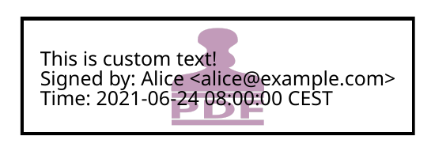

Signing functionality
=====================

.. |---| unicode:: U+02014 .. em dash
   :trim:

This page describes pyHanko's signing API.

.. note::
    Before continuing, you may want to take a look at the
    :ref:`background on PDF signatures <pdf-signing-background>` in the CLI
    documentation.

General API design
------------------

The value entry (``/V``) of a signature field in a PDF file is given by a PDF
dictionary: the "signature object".
This signature object in turn contains a ``/Contents`` key (a byte string)
with a DER-encoded rendition of the CMS object (see :rfc:`5652`) containing the
actual cryptographic signature.
To avoid confusion, the latter will be referred to as the "signature CMS object",
and we'll reserve the term "signature object" for the PDF dictionary that is the
value of the signature field.

The signature object contains a ``/ByteRange`` key outlining the bytes of the
document that should be hashed to validate the signature.
As a general rule, the hash of the PDF file used in the signature is computed
over all bytes in the file, except those under the ``/Contents`` key.
In particular, the ``/ByteRange`` key of the signature object is actually
part of the signed data, which implies that the size of the signature
CMS object needs to be estimated ahead of time. As we'll see soon, this has
some minor implications for the API design (see
:ref:`this subsection <extending-signer>` in particular).

.. |PdfSignatureMetadata| replace:: :class:`~.pyhanko.sign.signers.PdfSignatureMetadata`
.. |Signer| replace:: :class:`~.pyhanko.sign.signers.Signer`
.. |PdfCMSEmbedder| replace:: :class:`~.pyhanko.sign.signers.PdfCMSEmbedder`
.. |PdfSigner| replace:: :class:`~.pyhanko.sign.signers.PdfSigner`
.. |TimeStamper| replace:: :class:`~.pyhanko.sign.timestamps.TimeStamper`

The pyHanko signing API is spread across sevaral modules in the
:mod:`.pyhanko.sign` package. Broadly speaking, it has three aspects:

* |PdfSignatureMetadata| specifies high-level metadata & structural requirements
  for the signature object and (to a lesser degree) the signature CMS object.
* |Signer| and its subclasses are responsible for the construction of the
  signature CMS object, but are in principle "PDF-agnostic".
* |PdfSigner| is the "steering" class that invokes the |Signer| on an
  :class:`~.pyhanko.pdf_utils.incremental_writer.IncrementalPdfFileWriter`
  and takes care of formatting the resulting signature object according
  to the specifications of a |PdfSignatureMetadata| object.

This summary, while a bit of an oversimplification, provides a
decent enough picture of the separation of concerns in the signing API.
In particular, the fact that construction of the CMS object is delegated to
another class that doesn't need to bother with any of the PDF-specific
minutiae makes it relatively easy to support other signing technology
(e.g. particular HSMs).

A simple example
----------------

Virtually all parameters of |PdfSignatureMetadata| have sane defaults.
The only exception is the one specifying the signature field to contain the
signature |---| this parameter is always mandatory if the number of empty
signature fields in the document isn't exactly one.

In simple cases, signing a document can therefore be as easy as this:

.. code-block:: python

    from pyhanko.sign import signers
    from pyhanko.pdf_utils.incremental_writer import IncrementalPdfFileWriter

    cms_signer = signers.SimpleSigner.load(
        'path/to/signer/key.pem', 'path/to/signer/cert.pem',
        ca_chain_files=('path/to/relevant/certs.pem',),
        key_passphrase=b'secret'
    )

    with open('document.pdf', 'rb') as doc:
        w = IncrementalPdfFileWriter(doc)
        out = signers.sign_pdf(
            w, signers.PdfSignatureMetadata(field_name='Signature1'),
            signer=cms_signer,
        )

        # do stuff with 'out'
        # ...

The :func:`~.pyhanko.sign.signers.sign_pdf` function is a thin convenience
wrapper around |PdfSigner|'s :meth:`~.pyhanko.sign.signers.PdfSigner.sign_pdf`
method, with essentially the same API.
The following code is more or less equivalent.

.. code-block:: python

    from pyhanko.sign import signers
    from pyhanko.pdf_utils.incremental_writer import IncrementalPdfFileWriter

    cms_signer = signers.SimpleSigner.load(
        'path/to/signer/key.pem', 'path/to/signer/cert.pem',
        ca_chain_files=('path/to/relevant/certs.pem',),
        key_passphrase=b'secret'
    )

    with open('document.pdf', 'rb') as doc:
        w = IncrementalPdfFileWriter(doc)
        out = signers.PdfSigner(
            signers.PdfSignatureMetadata(field_name='Signature1'),
            signer=cms_signer,
        ).sign_pdf(w)

        # do stuff with 'out'
        # ...

The advantages of instantiating the |PdfSigner| object yourself include
reusability and more granular control over the signature's appearance.

In the above examples, ``out`` ends up containing a byte buffer
(:class:`.io.BytesIO` object) with the signed output.
You can control the output stream using the ``output`` or ``in_place``
parameters; see the documentation for
:meth:`~.pyhanko.sign.signers.PdfSigner.sign_pdf`.

.. danger::
    Any :class:`~.pyhanko.pdf_utils.incremental_writer.IncrementalPdfFileWriter`
    used in the creation of a signature should be discarded afterwards.
    Further modifications would simply invalidate the signature anyway.

For a full description of the optional parameters, see the API reference
documentation for |PdfSignatureMetadata| and |PdfSigner|.

.. warning::
    If there is no signature field with the name specified in the
    :attr:`~.pyhanko.sign.signers.PdfSignatureMetadata.field_name` parameter
    of |PdfSignatureMetadata|, pyHanko will (by default) create an invisible
    signature field to contain the signature.
    This behaviour can be turned off using the ``existing_fields_only`` parameter
    to :meth:`~.pyhanko.sign.signers.PdfSigner.sign_pdf`, or you can supply
    a custom field spec when initialising the |PdfSigner|.

    For more details on signature fields and how to create them, take a look at
    :doc:`sig-fields`.

Signature appearance generation
-------------------------------

.. seealso::

    :ref:`style-definitions` in the CLI documentation for the CLI equivalent, and
    :doc:`sig-fields` for information on how to create signature fields in general.

When creating visible signatures, you can control the visual appearance to a degree, using different
stamp types. This can be done in one of several ways.

Text-based stamps
^^^^^^^^^^^^^^^^^

PyHanko's standard stamp type is the *text stamp*. At its core, a text stamp appearance is simply
some text in a box, possibly with interpolated parameters. Text stamps can use TrueType and OpenType
fonts (or fall back to a generic monospaced font by default). Additionally, text stamps can also
have backgrounds.

Text stamp styles are (unsurprisingly) described by a :class:`~.pyhanko.stamp.TextStampStyle`
object. Here's a code sample demonstrating basic usage, with some custom text using a TrueType font,
and a bitmap background.

.. code-block:: python

    from pyhanko import stamp
    from pyhanko.pdf_utils import text, images
    from pyhanko.pdf_utils.font import opentype
    from pyhanko.pdf_utils.incremental_writer import IncrementalPdfFileWriter
    from pyhanko.sign import signers

    signer = signers.SimpleSigner.load(...)
    with open('document.pdf', 'rb') as inf:
        w = IncrementalPdfFileWriter(inf)
        fields.append_signature_field(
            w, sig_field_spec=fields.SigFieldSpec(
                'Signature', box=(200, 600, 400, 660)
            )
        )

        meta = signers.PdfSignatureMetadata(field_name='Signature')
        pdf_signer = signers.PdfSigner(
            meta, signer=signer, stamp_style=stamp.TextStampStyle(
                # the 'signer' and 'ts' parameters will be interpolated by pyHanko, if present
                stamp_text='This is custom text!\nSigned by: %(signer)s\nTime: %(ts)s',
                text_box_style=text.TextBoxStyle(
                    font=opentype.GlyphAccumulatorFactory('path/to/NotoSans-Regular.ttf')
                ),
                background=images.PdfImage('stamp.png')
            ),
        )
        with open('document-signed.pdf', 'wb') as outf:
            pdf_signer.sign_pdf(w, output=outf)

:numref:`text-stamp-basic` shows what the result might look like. Obviously, the final result will
depend on the size of the bounding box, font properties, background size etc.

.. _text-stamp-basic:

    A text stamp in Noto Sans Regular with an image background.

The layout of a text stamp can be tweaked to some degree, see
:class:`~.pyhanko.stamp.TextStampStyle`.

.. note::

    You can define values for your own custom interpolation parameters using the
    ``appearance_text_params`` argument to :meth:`~.pyhanko.sign.signers.PdfSigner.sign_pdf`.

QR code stamps
^^^^^^^^^^^^^^

Besides text stamps, pyHanko also supports signature appearances with a QR code embedded in them.
Here's a variation of the previous example that leaves out the background, but includes a QR code
in the end result.

.. code-block:: python

    from pyhanko import stamp
    from pyhanko.pdf_utils import text
    from pyhanko.pdf_utils.font import opentype
    from pyhanko.pdf_utils.incremental_writer import IncrementalPdfFileWriter
    from pyhanko.sign import signers

    signer = signers.SimpleSigner.load(...)
    with open('document.pdf', 'rb') as inf:
        w = IncrementalPdfFileWriter(inf)
        fields.append_signature_field(
            w, sig_field_spec=fields.SigFieldSpec(
                'Signature', box=(200, 600, 400, 660)
            )
        )

        meta = signers.PdfSignatureMetadata(field_name='Signature')
        pdf_signer = signers.PdfSigner(
            meta, signer=signer, stamp_style=stamp.QRStampStyle(
                # Let's include the URL in the stamp text as well
                stamp_text='Signed by: %(signer)s\nTime: %(ts)s\nURL: %(url)s',
                text_box_style=text.TextBoxStyle(
                    font=opentype.GlyphAccumulatorFactory('path/to/NotoSans-Regular.ttf')
                ),
            ),
        )
        with open('document-signed.pdf', 'wb') as outf:
            # with QR stamps, the 'url' text parameter is special-cased and mandatory, even if it
            # doesn't occur in the stamp text: this is because the value of the 'url' parameter is
            # also used to render the QR code.
            pdf_signer.sign_pdf(
                w, output=outf,
                appearance_text_params={'url': 'https://example.com'}
            )

:numref:`qr-stamp-basic` shows some possible output obtained with these settings.

.. _qr-stamp-basic:

    A QR stamp in Noto Sans Regular, pointing to `<https://example.com>`_

Static content stamps
---------------------

PyHanko is mainly a signing library, and as such, its appearance generation code is fairly
primitive. If you want to go beyond pyHanko's default signature appearances, you have the option
to import an entire page from an external PDF file to use as the appearance, without anything else
overlaid on top. Here's how that works.

.. code-block:: python

    from pyhanko import stamp
    from pyhanko.pdf_utils.incremental_writer import IncrementalPdfFileWriter
    from pyhanko.sign import signers

    signer = signers.SimpleSigner.load(...)
    with open('document.pdf', 'rb') as inf:
        w = IncrementalPdfFileWriter(inf)
        fields.append_signature_field(
            w, sig_field_spec=fields.SigFieldSpec(
                'Signature', box=(200, 600, 400, 660)
            )
        )

        meta = signers.PdfSignatureMetadata(field_name='Signature')
        pdf_signer = signers.PdfSigner(
            meta, signer=signer,
            stamp_style=stamp.StaticStampStyle.from_pdf_file('my-fancy-appearance.pdf')
        )
        with open('document-signed.pdf', 'wb') as outf:
            pdf_signer.sign_pdf(w, output=outf)

The result of this snippet with a file from pyHanko's test suite is shown in
:numref:`static-stamp-basic`. Essentially, this way of working allows you to use whatever tools
you like to generate the signature appearance, and use the result with pyHanko's signing tools.
The bounding box of the content is derived from the imported page's ``MediaBox`` (i.e. the principal
page bounding box), so take that into account when designing your own appearances.

.. note::

    The external PDF content is imported "natively": all vector operations will remain vector
    operations, embedded fonts are copied over, etc. There is no rasterisation involved.

.. _static-stamp-basic:

    Example of a signature appearance using a stamp imported from an external PDF file.

Timestamp handling
------------------

Cryptographic timestamps (specified by :rfc:`3161`) play a role in PDF
signatures in two different ways.

* They can be used as part of a PDF signature (embedded into the signature
  CMS object) to establish a (verifiable) record of the time of signing.
* They can also be used in a stand-alone way to provide document timestamps
  (PDF 2.0).

From a PDF syntax point of view, standalone document timestamps are formally
very similar to PDF signatures.
PyHanko implements these using the
:meth:`~.pyhanko.sign.signers.PdfTimeStamper.timestamp_pdf` method of
:class:`~.pyhanko.sign.signers.PdfTimeStamper`
(which is actually a superclass of |PdfSigner|).

Timestamp tokens (TST) embedded into PDF signatures are arguably the more common
occurrence. These function as countersignatures to the signer's signature,
proving that a signature existed at a certain point in time.
This is a necessary condition for (most) long-term verifiability schemes.

Typically, such timestamp tokens are provided over HTTP, from a trusted time
stamping authority (TSA), using the protocol specified in :rfc:`3161`.
PyHanko provides a client for this protocol; see
:class:`~.pyhanko.sign.timestamps.HTTPTimeStamper`.

A |PdfSigner| can specify a default |TimeStamper| to procure timestamp tokens
from some TSA, but sometimes pyHanko can infer a TSA endpoint from the signature
field's seed values.

The example from the previous section doesn't need to be modified by a lot
to include a trusted timestamp in the signature.

.. code-block:: python

    from pyhanko.sign import signers
    from pyhanko.pdf_utils.incremental_writer import IncrementalPdfFileWriter

    cms_signer = signers.SimpleSigner.load(
        'path/to/signer/key.pem', 'path/to/signer/cert.pem',
        ca_chain_files=('path/to/relevant/certs.pem',),
        key_passphrase=b'secret'
    )

    tst_client = timestamps.HTTPTimeStamper('http://example.com/tsa')

    with open('document.pdf', 'rb') as doc:
        w = IncrementalPdfFileWriter(doc)
        out = signers.sign_pdf(
            w, signers.PdfSignatureMetadata(field_name='Signature1'),
            signer=cms_signer, timestamper=tst_client
        )

        # do stuff with 'out'
        # ...

As a general rule, pyHanko will attempt to obtain a timestamp token whenever
a |TimeStamper| is available, but you may sometimes see more TST requests
go over the wire than the number of signatures you're creating.
This is normal: since the timestamps are to be embedded into the signature CMS
object of the signature, pyHanko needs a sample token to estimate the CMS
object's size\ [#tstsize]_.
These "dummy tokens" are cached on the |TimeStamper|, so you
can cut down on the number of such unnecessary requests by reusing the same
|TimeStamper| for many signatures.

Creating PAdES signatures
-------------------------

Creating signatures conforming to various PAdES baseline profiles is also
fairly straightforward using the pyHanko API.

To create a PAdES B-LTA signature, you can follow the template of the example
below. This is the most advanced PAdES baseline profile. For other PAdES
baseline profiles, tweak the parameters of the |PdfSignatureMetadata| object
accordingly.

.. code-block:: python

    from pyhanko.pdf_utils.incremental_writer import IncrementalPdfFileWriter
    from pyhanko.sign import signers, general, timestamps
    from pyhanko.sign.fields import SigSeedSubFilter
    from pyhanko_certvalidator import ValidationContext

    # Load signer key material from PKCS#12 file
    # This assumes that any relevant intermediate certs are also included
    # in the PKCS#12 file.
    signer = signers.SimpleSigner.load_pkcs12(
        pfx_file='signer.pfx', passphrase=b'secret'
    )

    # Set up a timestamping client to fetch timestamps tokens
    timestamper = timestamps.HTTPTimeStamper(
        url='http://tsa.example.com/timestampService'
    )

    # Settings for PAdES-LTA
    signature_meta = signers.PdfSignatureMetadata(
        field_name='Signature', md_algorithm='sha256',
        # Mark the signature as a PAdES signature
        subfilter=SigSeedSubFilter.PADES,
        # We'll also need a validation context
        # to fetch & embed revocation info.
        validation_context=ValidationContext(allow_fetching=True),
        # Embed relevant OCSP responses / CRLs (PAdES-LT)
        embed_validation_info=True,
        # Tell pyHanko to put in an extra DocumentTimeStamp
        # to kick off the PAdES-LTA timestamp chain.
        use_pades_lta=True
    )

    with open('input.pdf', 'rb') as inf:
        w = IncrementalPdfFileWriter(inf)
        with open('output.pdf', 'wb') as outf:
            signers.sign_pdf(
                w, signature_meta=signature_meta, signer=signer,
                timestamper=timestamper, output=outf
            )

.. _extending-signer:

Extending |Signer|
------------------

Providing detailed guidance on how to implement your own |Signer| subclass
is beyond the scope of this guide |---| the implementations
of :class:`~.pyhanko.sign.signers.SimpleSigner` and
:class:`~.pyhanko.sign.pkcs11.PKCS11Signer` should help.
This subsection merely highlights some of the issues you should keep in mind.

First, if all you want to do is implement a signing device or technique that's
not supported by pyHanko, it should be sufficient to implement
:meth:`~.pyhanko.sign.signers.Signer.sign_raw`.
This method computes the raw cryptographic signature of some data (typically
a document hash) with the appropriate key material.
It also takes a ``dry_run`` flag, signifying that the returned object should
merely have the correct size, but the content doesn't matter\ [#signerdryrun]_.

If your requirements necessitate further modifications to the structure of the
CMS object, you'll most likely have to override
:meth:`~.pyhanko.sign.signers.Signer.sign`, which is responsible for the
construction of the CMS object itself.

The low-level |PdfCMSEmbedder| API
----------------------------------

If even extending |Signer| doesn't cover your use case (e.g. because you want
to take the construction of the signature CMS object out of pyHanko's hands
entirely), all is not lost.
The lowest-level "managed" API offered by pyHanko is the one provided by
|PdfCMSEmbedder|. This class offers a coroutine-based interface
that takes care of all PDF-specific operations, but otherwise gives you full
control over what data ends up in the signature object's ``/Contents`` entry.

.. note::
    |PdfSigner| uses |PdfCMSEmbedder| under the hood, so you're still mostly
    using the same code paths with this API.

.. danger::
    Some advanced features aren't available this deep in the API (mainly seed
    value checking). Additionally, |PdfCMSEmbedder| doesn't really do any
    input validation; you're on your own in that regard.

Here is an example demonstrating its use, sourced more or less directly from
the test suite. For details, take a look at the API docs for |PdfCMSEmbedder|.

.. code-block:: python

    from datetime import datetime
    from pyhanko.sign import signers
    from pyhanko.pdf_utils.incremental_writer import IncrementalPdfFileWriter

    from io import BytesIO

    input_buf = BytesIO(b'<input file goes here>')
    w = IncrementalPdfFileWriter(input_buf)

    # Phase 1: coroutine sets up the form field, and returns a reference
    cms_writer = signers.PdfCMSEmbedder().write_cms(
        field_name='Signature', writer=w
    )
    sig_field_ref = next(cms_writer)

    # just for kicks, let's check
    assert sig_field_ref.get_object()['/T'] == 'Signature'

    # Phase 2: make a placeholder signature object,
    # wrap it up together with the MDP config we want, and send that
    # on to cms_writer
    timestamp = datetime.now(tz=tzlocal.get_localzone())
    sig_obj = signers.SignatureObject(timestamp=timestamp, bytes_reserved=8192)

    md_algorithm = 'sha256'
    # for demonstration purposes, let's do a certification signature instead
    # of a plain old approval signature here
    cms_writer.send(
        signers.SigObjSetup(
            sig_placeholder=sig_obj,
            mdp_setup=signers.SigMDPSetup(
                md_algorithm=md_algorithm, certify=True,
                docmdp_perms=fields.MDPPerm.NO_CHANGES
            )
        )
    )

    # Phase 3: write & hash the document (with placeholder)
    document_hash = cms_writer.send(
        signers.SigIOSetup(md_algorithm=md_algorithm, in_place=True)
    )

    # Phase 4: construct the CMS object, and pass it on to cms_writer

    # NOTE: I'm using a regular SimpleSigner here, but you can substitute
    # whatever CMS supplier you want.

    signer: signers.SimpleSigner = FROM_CA
    # let's supply the CMS object as a raw bytestring
    cms_bytes = signer.sign(
        data_digest=document_hash, digest_algorithm=md_algorithm,
        timestamp=timestamp
    ).dump()
    output, sig_contents = cms_writer.send(cms_bytes)

.. rubric:: Footnotes

.. [#signerdryrun]
   The ``dry_run`` flag is used in the estimation of the CMS object's size.
   With key material held in memory it doesn't really matter all that much,
   but if the signature is provided by a HSM, or requires additional input
   on the user's end (such as a PIN), you typically don't want to use the "real"
   signing method in dry-run mode.

.. [#tstsize]
   The size of a timestamp token is difficult to predict ahead of time, since it
   depends on many unknown factors, including the number & form of the various
   certificates that might come embedded within them.
